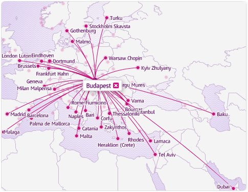

# Trip Planning Bot




### Overview:

Where will I go in Europe for 2 weeks? Should I travel fast or cheap? For 3 months in Europe, I have to plan a lot of trips, especially during the 2 week Fall Break. Therefore, I created this program to help is make OPTIMAL decisions based on prices and time. 

I taked data from Wizz Air, Ryanira Air along with DB Train, Eurail Train, and FlixBus for prices and duration information. Then based on
users input, the program will generate the optimal trip with of course many options to choose.


### Features:
Our program uses a queue in the breadthFirstSearch method (lines 78-101) in PathFinder.java. We enqueue the start item (line 84), then enqueue its neighbors(line 95). We continue dequeuing the first item and adding its neighbors to the queue until the queue is empty. 
Method is shown below:
```java
  public Map<Integer, Integer> breadthFirstSearch(String start) {
    boolean visited[] = new boolean[wikiGraph.numVerts()];
    LinkedList<Integer> queuee = new LinkedList<Integer>();
    Map<Integer, Integer> predeMap = new HashMap<Integer, Integer>();
    int startNum = articleVertex.get(start);
    visited[startNum] = true;
    queuee.add(startNum);
    predeMap.put(startNum, null);
    while(queuee.size() !=0){
      int curNum;
      curNum = queuee.poll();
      Iterable<Integer> testi = wikiGraph.getNeighbors(curNum);
      Iterator<Integer> yo = testi.iterator();
      while (yo.hasNext() ){
        int n = yo.next();
        if (visited[n] == false){
          visited[n] = true;
          queuee.add(n);
          predeMap.put(n, curNum);
        }
      }
    }
    return predeMap;
  }
  ```


### States if no path is possible:
Our program will send a friendly message letting the user know that there is no path if none exists. See below:
```
What would you like the starting destination to be?
Budapest
What would you like the ending page to be?
Athens
Sorry! Looks like there are no possible paths :((
```

### toString implemented as specified:
Our toString method can be found on lines 147-153 of PathFinder.java. As specified, it returns a string that represents the number of edges and verticies in the graph. 

To test this, uncomment line 169. This should print:
```
119882 4604
```
The first number represents the total number of edges, and the second number represents the total number of verticies. 

### Contact: https://www.linkedin.com/in/duyngp/
